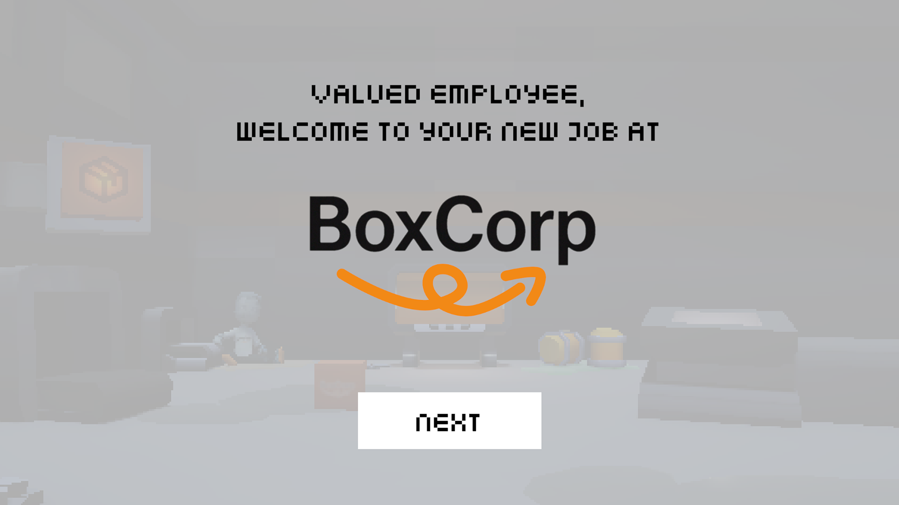
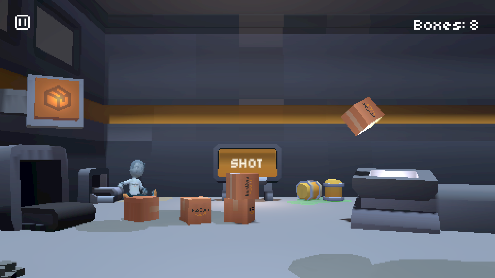
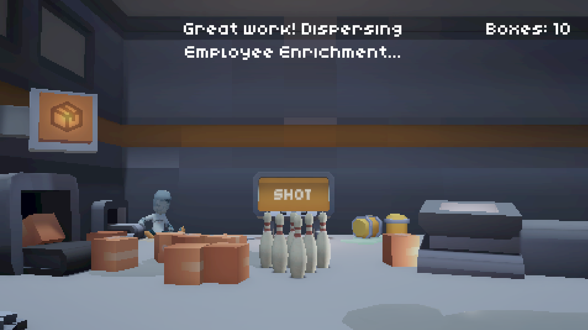
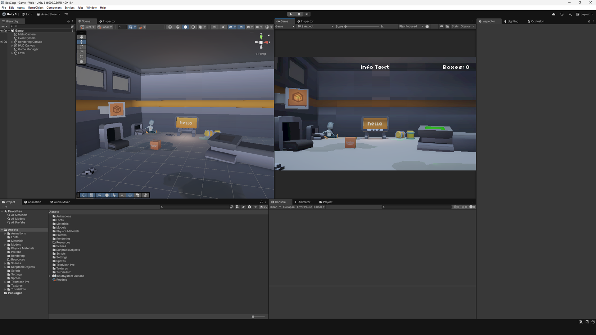

# BoxCorp

This is a sample Unity game project for the Spatial Unity engineer take-home exercise.

Built in Unity 6000.0.36f1 using the Universal Render Pipeline. 

## Try it!
- Watch the demo video: https://www.youtube.com/watch?v=dyZxP89sN84
- Play the game in your browser here: https://logankemper.itch.io/boxcorp
- Password: boxes

## Screenshots

